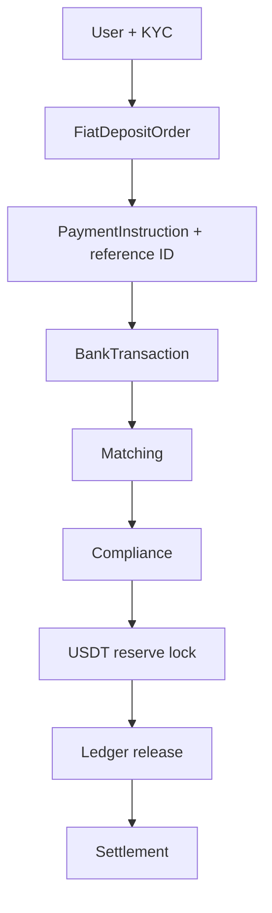

# Architecture

## Назначение

Система обслуживает полный цикл `fiat -> USDT`:

## Принцип

- Модель `agent` и `merchant` выбирается на уровне партнера и заявки.
- UI disclosure, bank narrative, accounting и settlement должны использовать тот же `modelType`.
- Финансовые действия идут через audit log.
- USDT release невозможен без matched payment, compliance approval и reserve lock.

## Apps

- `apps/api`: REST API, JSON demo DB, static hosting.
- `apps/web-user`: заявка и статус пользователя.
- `apps/web-partner`: подтверждение фиата и reserve.
- `apps/web-admin`: order control room, compliance, reserve, settlement, audit.
- `apps/web-user/legal.html`: публичный просмотр загруженных соглашений.

## Packages

- `domain`: статусы, transitions, quote, disclosure, seed.
- `matching`: сверка bank transaction с заявкой.
- `compliance`: risk flags и holds.
- `ledger`: double-entry USDT ledger и reserve locks.
- `settlement`: расчетный batch.
- `integrations`: нормализация внешних bank/PSP payloads.
- `security`: token auth, readiness checks, headers, release guards.
